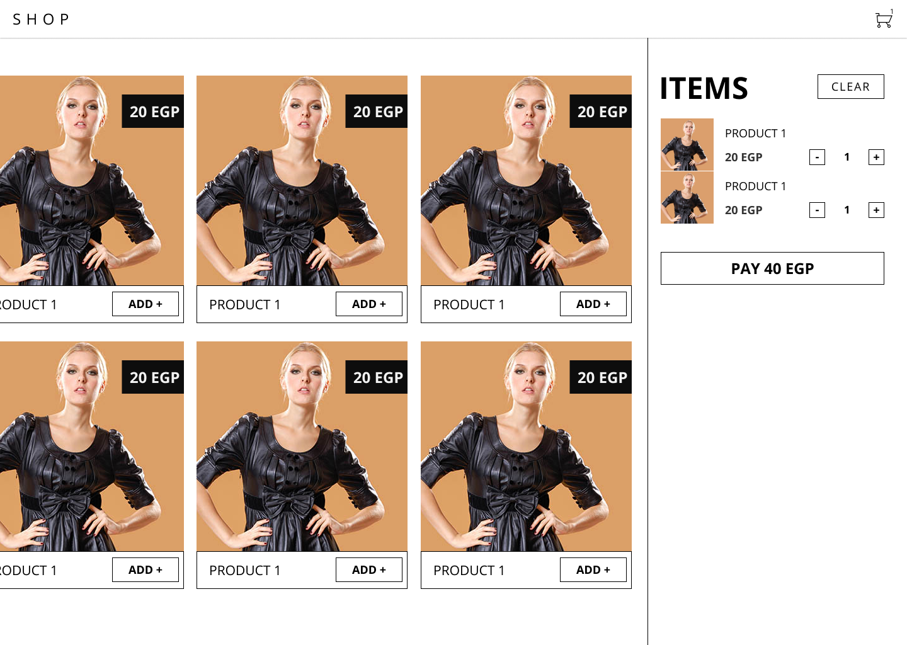

# Local Cart

The folowing task is intended to evaluates your Frontend UI and Application Development skills.

Complete it to your personal professional satisfaction.

Implement **[this deisgn][figma link]** (open the link to view the mobile view)

[][figma link]

> If you sign in to figma you can export the assets (like cart icon etc) from the design

## Restrictions

- You may use a framework of your choosing.
- Vanilla JS is better, jQuery is worse.
- Please don't use any extra libraries if you can. (no bootstrap, it's not worth it)
- The design should be responsive (as shown in the design link)
- You should use ES6+ Javascript Features, all modern browsers support ES Modules and async/await
- Create a repo for the project and publish it as a [Github page](https://pages.github.com/) or using [now.sh](https://now.sh/)
- Use this backend API `https://faker-api-yczfsfkfcd.now.sh/api/products` endpoint to load the products
    - You may save and load the data locally if it's more suitable
- You must create a cart.js file that manages your cart state **which is furthur explained bellow**

#### cart.js

`cart.js` should contain the cart logic and should be designed to work with any framework or pure JS

- Your cart js is a class that extends an EventEmitter
- Cart is exported from an es module (modern browsers supprt es-modules)
- The class should contain the state of the cart 
- The class should expose action methods for **adding removing incrementing and decrementing** items
- The class should expose way to **get the state** of the cart directly
- You must also implement the **EventEmitter** class which has a **subscribe, publish, and unsubscribe** methods 
- The cart.js action methods should publish an event on the cart calss `"cart.changed"` 
- Implement a cart.test.js file that tests the cart.js

For example if you are using react your code can (but should not have to) work like this

```js
import React from "react"
import Cart from "./cart"

let cart = new Cart()

export default class UI extends React.Component {
  state = {
    cart: cart.getState()
  }
  componentDidMount() {
      cart.subscribe("cart.changed", this.setState({ cart: cart.getState() }))
  }
  render() {
    return <button onClick={() => cart.addItem({})}>Add</button>
  }
}
```

This way when an action in the UI occures it updates the cart and it in turn the cart will update all it's subscribers.
You meight notice this approach can be used with any framework.

> You are allowed to vary on the details of the implementation so long as your cart logic is isolated, framework agnostic, and reactive.

## Evaluation criteria

- You are judged on the cleanliness of your code [here's a summary of Clean Code for JS](https://github.com/ryanmcdermott/clean-code-javascript)
- The design decisions you take 
- Think of Developer eXperience by organizing your components/modules if you're using any (this can be done even with pure JS).
- In other words, You are mostly not evaluated on completness but quality, show us what you've got.

## Extra points

- Using typescript or flow is a plus


[figma link]: https://www.figma.com/file/YdHvYic4a8F0Hu7l6YQnDhvr/CartTask?node-id=0%3A1
